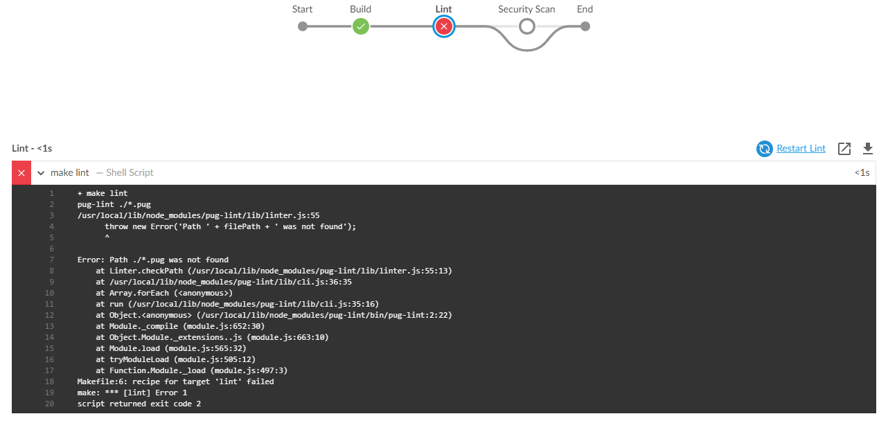

# Scalable Personal Profile Page


## Overview

To simulate continuous integration/deployment and modern microservice 
architecture using modern framework, the author presents his
personal profile page (under development) using Node.js + Express.

Technologies Used:
1. Node.js + Express
2. Docker
3. Kubernetes (kubectl, minikube)
4. Amazon CloudFormation
5. Amazon Elastic Kubernetes Service
6. Amazon Elastic Container Registry

## Directory Structure

The author would like to interest the readers to the following directories:

1. __ias-scripts__ - to where cloudformation, EKS and ECS infrastructure and service deployment scripts are stored.
2. __bin, node\_modules, public, routes, views__ - the Node.js + Express application

The author also would like to interest you to the files in the root directory:
1. __Dockerfile__ - docker build and run definition for the app
2. __jenkinsfile__ - pipeline for linting, security scan, building docker image, deploying docker image, pushing docker to Amazon ECR, and cleaning Jenkins environment.
3. __Makefile__ - where lint definition is located
4. __run\_kubernetes.sh__ - for running the Docker image locally using minikube.


## Instructions

### Jenkins Pipeline

1. Jenkins pipeline starts from Linting stage that includes linting html files using tidy, linting pug files using pug-lint and linting Dockerfile using hadolint.




2. Next is security scan for Docker files using Aqua Microscanner


3. Next, we build docker image for the project


4. After that, we deploy Docker image to DockerHub at anvillasoto/scalable-personal-profile-page


5. The author also uploads the image to ECR (in order to enable this, follow setup instructions from Infrastructure Deployment: Note Number 3)


6. Lastly, house cleaning


### Infrastructure Deployment

#### Notes:

For infrastructure deployment, we need to assume few things like so:

1. Jenkins is set up with AWS credentials encompassing fill permissions if posible for EC2, VPC, Subnets, EKS and ECS services from AWS.
2. Linux environment that will be used to execute CloudFormation and kubectl apply scripts must have configured using
```
aws configure
```
with access ID and secret access key of IAM user with preferably Administrator privileges before executing the scripts provided in the ias-scripts directory.

Assuming that all of the assumptions above are resoved, we will proceed to infrastructure and server deployment.

3. You must have created a repository from Amazon ECR and copy the URI. Note this URI for later.


Copy the URI and and change the Jenkinsfile section with the URI you copied. 


#### Steps:

1. Execute the following commands:

```
./create.sh scalable-personal-profile-page-infrastructure cloudformation-eks.yaml cloudformation-eks-parameters.json
```


2. Modify the __eks-nodegroup-parameters.json__ by supplying KeyName, Subnets, VpcID, and ClusterName from the output of the CloudFormation


3. Execute the following command to deploy servers for Kubernetes nodes and create the EKS cluster.

```
./create.sh scalable-personal-profile-page-servers eks-nodegroup.yaml eks-nodegroup-parameters.json
```


4. Update a kubeconfig file from using local kubectl to using newly-created kubernetes cluster.

```
aws eks --region us-west-2 update-kubeconfig --name scalable-personal-profile-page-cluster
kubectl get svc
```


NOTE:
if you are having problems after executing the second line with specific error message __You must be logged in to the server (Unauthorized)__,
follow this [GitHub answer](https://github.com/kubernetes-sigs/aws-iam-authenticator/issues/174#issuecomment-450651720) for solutions.

5. Allow worker nodes to be accessed in your Linux instance, follow this tutorial from [AWS Documentation](https://docs.aws.amazon.com/eks/latest/userguide/add-user-role.html)
specifically on the __To apply the aws-auth ConfigMap to your cluster__ section. Note that the __<ARN of instance role (not instance profile)>__ is the output of the recent CloudFormation script from Step 3.


After following the tutorial properly, you must see the output like this (nodes depend on your configuration)


6. Change the __ecr-to-eks-deployment.yaml__ by adding the URI you noted from Infrastructure Deployment: Note Number 3, appending with __:latest__ like so:


7. Execute the following commands for ECR to EKS application deployment:

```
kubectl apply -f ecr-to-eks-deployment.yaml
kubectl apply -f ecr-to-eks-deployment-service.yaml 
kubectl get svc ecr-to-eks-deployment-service -o yaml
```


Take note of the URI from below. This will be the URL to access the application.


## Rolling Deployment

The author used rolling deployment for this app due to its simplicity and small 
infrequent push-to-deploy strategy. Backed with Jenkins, the author made sure 
that changes, however infrquent are gradually reflected to the docker images 
saved in ECS, deloyed on EKS cluster created, all in a seamless trigger of 
pushing to the master branch.


For example, looking at the image above, recent commits with message 
__modify Jenkinsfile Push docker imag...__ and __change port 3005 to port 80__ 
both pushed to the master branch are detected by Jenkins. The result of the builds are shown below:

1. For former commit:


2. For latter commit:


## Credits

1. Special thanks to uideck.com to where assets and main layout of this page came from. For personal use only. See license.txt for details.

2. For converting html to pug views, the author used [https://html-to-pug.com/](https://html-to-pug.com/).

3. Big thanks to https://github.com/ForgeRock for providing a snippet to deploy EKS using CloudFormation. Code can be accessed [here](https://github.com/ForgeRock/forgeops/blob/master/etc/amazon-eks-vpc.yaml).
  Full script [here](https://www.devopsnipp.com/snippets/Create-Amazon-EKS-VPC-)

4. For the ARN Role, a helpful script was based on [here](https://medium.com/@dhammond0083/aws-eks-managed-setup-with-cloudformation-97461300e952)
  
